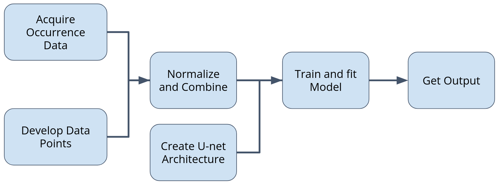

# CS EE5841 Final Project: Creating a Species Distribution Model Using a U-Net Architecture

### Project Overview

The goal of this project was to create a Species Distribution Model (SDM) using Image Segmentation. Instead of trying to return a 1 or 0 for segmenting an image, a probability distribution is returned. The probability is the likelihood of finding an animal of the species occurances trained on at that location.

This is done by using a U-Net model to perform the image segmentation. The inputs are environment variable. This project only uses two data points: distance to forest and distance to water. To make a more reliable and accurate model, more environment variables would be needed. The targets for training the model are normalized occurance data. Normalizing the occurance data from zero to one allows for a probabilistic output. The output is then the probability distribution discussed earlier.


The data used in this project is very large and is unable to be put into the repository. So instead, the data was put into a Google Share Drive so that the drive can be mounted each time Colab is used. This makes it so the data doesn't need to be uploaded every time the notebook is used.

Below is a workflow diagram of the project.



### Repository Structure

```
EE5841-FP/
    images/
    notebooks/
        EE5841_FP_Group4.ipynb
    report/
    scripts/
        forest_cover.py
        land_cover.py
    README.md
```

##### images/
The images directory holds all figures used in this README.md and final report. The output pictures can be viewed in the notebook.

##### notebooks/
The notebooks directory has the python notebook for the project. This notebook should be ran in Google Colab as that is where the file was mainly run.

##### report/
The report directory has the final report pdf in it.

##### scripts/
This folder has extra scripts used to generate raster data for the distance to forest and distance to water data. These scripts have a lengthy runtime and only had to be run once to obtain the raster data. These scripts use the rasterio library to extract and create the data.

### Notebook Usage

The notebook, 'EE5841_FP_Group4.ipynb', is the only notebook used in this project. It contains the U-Net Model, preprocessing, and training. It is recommended that the notebook is run in Google Colab using the GPU runtimes for best performance. It is recommended that the cells are run one by one. 

The first cell will import all necessary packages and check for a GPU to use.

The second cell will generate the data samples to train on. The 'num_data' variable at the top determines the amount of samples generated. As of right now it is 500.

The third and fourth cell creates the U-Net model and the fourth cell gives a summary of the model. The model has ~31 million parameters. The model consists of four encoder blocks, a two bottleneck layers, and four decoder blocks with an output layer on the end. The model uses a learning rate of 1e-5, the Adam optimizer, and 'accuracy' for metrics. 

The following cell will train the model. The batch size and epoch variables are fairly intuitive to what they do. The number of epochs originally trained on was 10 and then the batch size was 32.

The last two cells are for evaluation. The first one graphs the loss over the epochs and the accuracy as well. The second one samples the model with some of the inputs used in training to visualize what the model is doing and how the input is related to the output.

**Note:** Without the raster data, the notebook cannot be trained, and with Github file size limits, that data is not in this repository. If the data is needed, please contact one of the group members to provide access to the data.